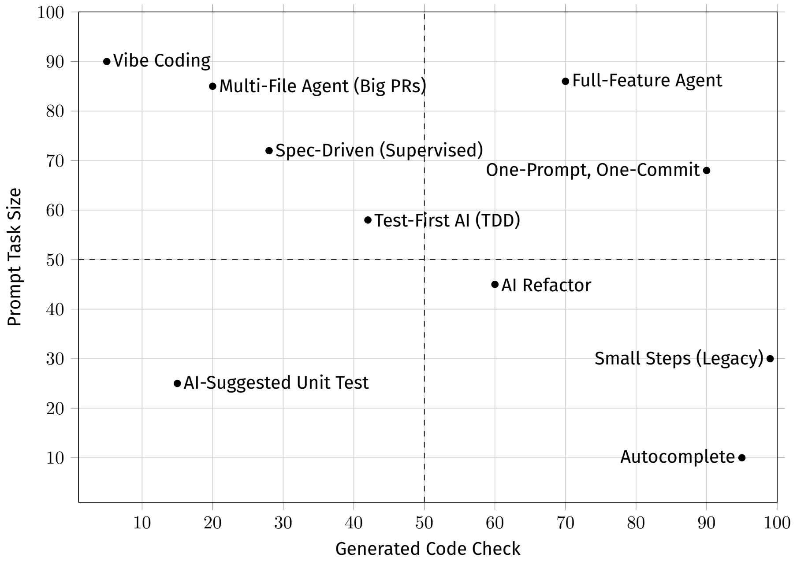

# CHAPTER 1: Going with the Vibe

play is one of the best ways to learn

build a game

AI assistant agent mode - let it handle most of the heavy lifting — including writing the actual code

vibe coding

## Vibe Coding a Game

we’ll have the LLM create a Jewel Swap game in
Python. We’ll use Pygame

### Preparing the IDE

For this project, we’ll use **Windsurf** as our AI-assisted IDE.1 It’s the one I
personally prefer, but of course, there are other solid options like Claude
Code,2 Cursor,3 Copilot,4 or Cline.5 Things move fast, and the tools keep
evolving.

Windsurf is a stand-alone IDE based on a fork of Visual Studio Code. A plugin
is also available if you’re using IntelliJ or PyCharm.

(JBOY: **Devin Desktop** is the new name for Windsurf. --- from https://devin.ai/download#all-downloads)

### The Jewel Swap Game

screencast
6. https://youtu.be/7DV4MvSR1v0

(JBOY: prompt> can you write a game like Jewel Shuffle in Python, using pydame for my doughter? Please make it cute, and playable with mouse.)
(see folder `/Ch01 JewelShuffle` for result)

## Improving Your Prompts

prompt engineering

One common strategy for tackling harder problems is called chain-of-thought
reasoning.

- The problem is that while the reasoning often looks solid, the final outcome
is far from guaranteed.

The good news is that we’re not powerless. By changing how we interact with
these systems, we can greatly reduce the frequency of those mistakes. When
prompting an LLM, it’s better to think less like you’re talking to a person and
more like you’re designing an input that maximizes the chance of getting the
output you want. The mindset shift is from conversation to probability
shaping.

• First, guide it—don’t try to convince it:

• Second, start with the shape of the result:

• Third, use structure and roles:

• Fourth, prime with context:

• Finally, iterate like an engineer:

### Does It Pay to Be Polite?

As you may have noticed, I usually keep a **polite tone** with AI assistants. I use please,
thank you, could you, and so on. Is it a good idea?

For me, yes. It helps me stay relaxed and focused.

## Writing a More Complex Game with AI

Andrej Karpathy (former Tesla AI director and founding member of OpenAI)
coined the term **vibe coding** in a tweet on February 3, 2025 ...

That approach can lead to all sorts of **problems**,
as we’re going to see.

> Please write the code for a flight simulator of jet fighter on a mountain
> ground. The goal of the game is to reach the goal avoiding the radar
> staying as low as possible. Use pygame and any library you think can help.

screencast
7. https://youtu.be/roO8VFa83j4

Building a simple yet engaging flight simulator is absolutely possible with an
AI assistant. You just need to know how to **guide it properly**, and how to give
it the right instructions.

## What Went Wrong

### Hallucinations

(JBOY: There's a very interesting conversation to be had about whether that is truly the fight word to describe this behavior. -- from page 79 of "Quick Start Guide to Large Language Models" 2nd edition by Sinan Ozdemir)

(JBOY: Grady Booch prefer to use the term "confabulate", in ("Software architecture, human judgment, and AI's limits with Grady Booch")[https://www.youtube.com/watch?v=oRjLzxg8q6A])

This happens because of how LLMs work. They don’t “know” facts—they
**predict the next most likely word** based on patterns they’ve seen during
training. When the model doesn’t have a clear answer, it still tries to fill the
gap with something that sounds right. In short, hallucinations aren’t magic
or mystery—they’re a a statistical side effect 8 of a system designed to be fluent
rather than certain.

8. https://arxiv.org/html/2509.04664v1

### The Drunken Intern

For the same reasons, it’s also very tricky to measure LLMs’ capabilities. As
the paper “What Does Human Evaluation Even Mean?” 9 explains, LLMs often
outperform humans in tests and benchmarks not because they “understand”
more but because they exploit patterns and shortcuts in the tests themselves.

9. https://arxiv.org/pdf/2502.07445

### Losing Context

This usually comes down to **context window limitations**. The model can only
“see” a certain number of **tokens** at a time.

### The Loop of Death

LLMs don’t actually understand the code.
They’re just predicting likely patterns.

### Random Results

### Low-Quality Code

Now, you might think, “Who cares? If it works, it works.”

But it doesn’t work like that. **Poor-quality code is much harder for LLMs to fix or refactor later.** It increases the chances of falling into traps like the loop
of death we talked about earlier. And once the code becomes unreadable, it
slows you down too, especially when you have to step in and fix things manually.

Paradoxically, **bad code creates more problems for the LLM than it does for a human**. We can often reason our way through a mess. The assistant, on
the other hand, just gets confused.

### Performance Traps

### Hidden Costs

thousands or even millions of **tokens** in a
single session

### Security Nightmares

### Missing or Misleading Observability

### The Mindset Trap

Maybe the most dangerous issue isn’t in the code at all but in how we think.

This mindset shift — letting go of control and curiosity — can have long-term
consequences on the whole product.

## Using Specifications to Drive Assistants

One way to reduce some of these problems is to use **Spec-Driven Development**.

(see book)

### Spec-Coding a Little Platform Game

screencast
11. https://youtu.be/atpjMv336RE

(in screencast - uses OpenAI Codex v 0.58.0, model: gpt-5.1-codex)

### Command-Line Assistants

If you watched the video, you saw that I used Codex,12 OpenAI’s commandline
assistant, for this exercise. Unlike Cursor or other IDE-based tools, these
assistants (Claude Code, OpenCode, and similar ones) run in the terminal
and behave more like a specialized shell than an editor.

### Is Code Now Irrelevant?

Some people, like Sean Grove from OpenAI, argue that just as modern languages
are abstractions over assembly, specifications could become abstractions
over code. 13 According to this view, we could treat code as a temporary
artifact (like compiled binaries) and use the specification as the real source
of truth.

With all due respect, I don’t agree that “code is a lossy projection of specifications.”
**A lot of knowledge doesn’t live in the spec.** It appears during the iterative
process of writing, refining, and understanding code.

As Eoin Woods put it when reviewing this book: “Layers of formally defined
languages and reification between them is **totally different** to a nondeterministic
translation from natural language to formal language.”

13. https://www.youtube.com/watch?v=8rABwKRsec4

### Running the Same Spec Twice

screencast
14. https://youtu.be/78-302HxG5g

Both runs produced a reasonable interpretation of the brief and the specification,
but they did it differently. It’s difficult to imagine a natural-language
specification precise enough to avoid these kinds of variations. And even if it
were possible, how large would that document be?

Are we sure replacing a well-organized codebase with hundreds or thousands
of pages of Markdown documents would be an improvement? Which one
would you rather browse to find a bug?

### Vibe Coding and Spec-Driven Development: The Good Parts

This isn’t a binary choice; it’s a spectrum. On one end you have fully controlled
development, on the other pure vibe coding.

The diagram at the top of the next page shows how the different ways of using
AI assistants relate to each other along two dimensions: prompt task size,
which is how large a feature you’re asking for at once, and generated code
review, meaning how carefully you check the code before committing it. Each
style has its place, so there’s no single “right way.”

JBOY: keywords: 
- Vibe COding, 
- Multi_file Agent (Big PRs)
- Spec-Driven (Supervised)
- One-Prompt, One-Commit
- Test-First AI (TDD)
- Full-Feature Agent
- AI Refactor
- AI-Suggested Unit Test
- Small Steps (Legacy)
- Autocomplete

## What We Covered

• AI can deliver impressive results:

• AI can fail miserably:

• Lack of process leads to chaos:

In the next chapter, we’ll start with a set of practices to help keep the risks
of working with AI assistants under control without giving up (much of) the
speed and convenience that make LLMs so appealing.